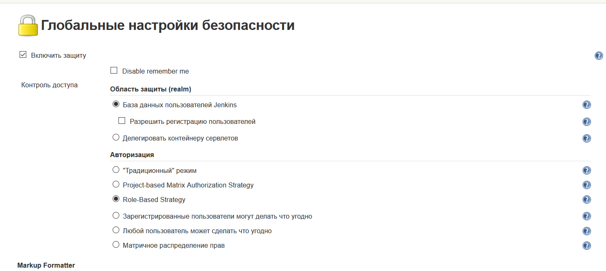
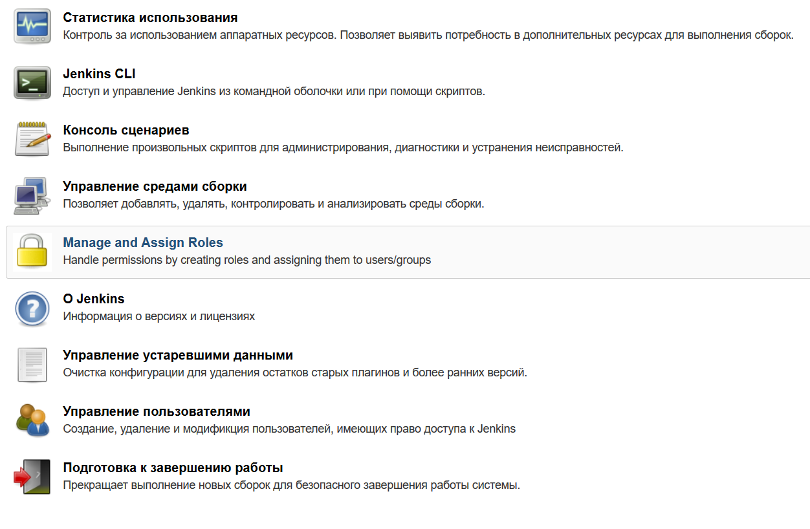
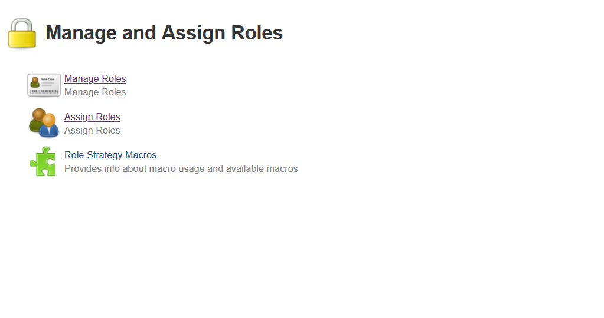
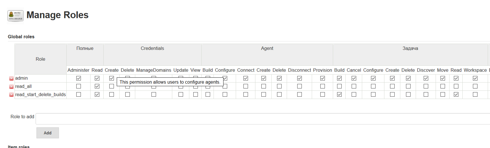
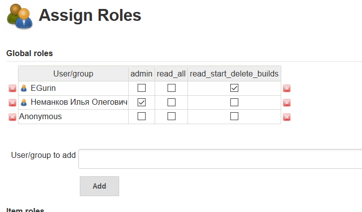

# How to configure Jenkins users with roles

### Setup *Role-based Authorization Strategy*
Go to the plugin manager and install this plugin

https://plugins.jenkins.io/role-strategy/

Next go to the Jenkins settings and Global security config.

Choose Role-Based strategy

Next choose Manage and Assign roles.

Then you can create new roles in Manage Roles menu and assign roles with users in assign roles menu.

